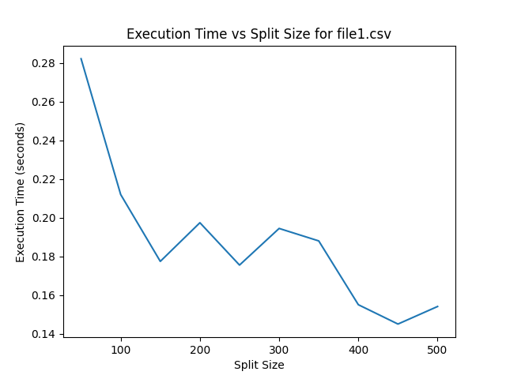
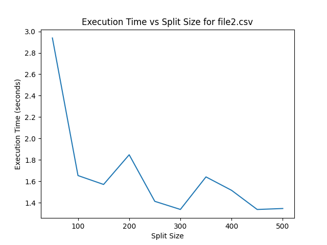
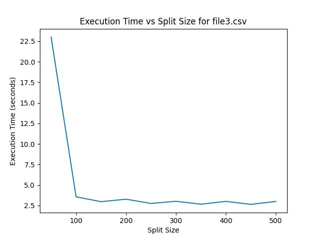
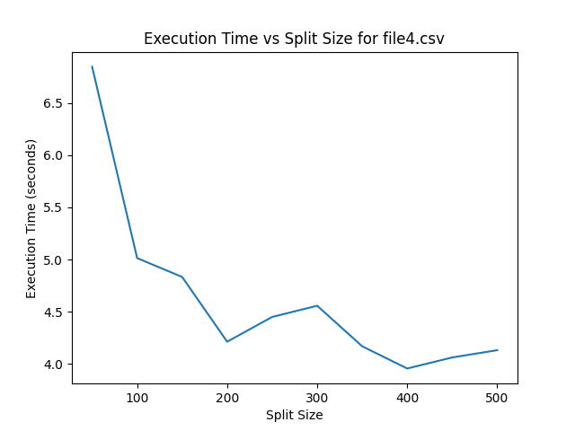
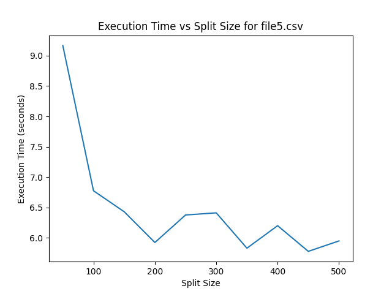
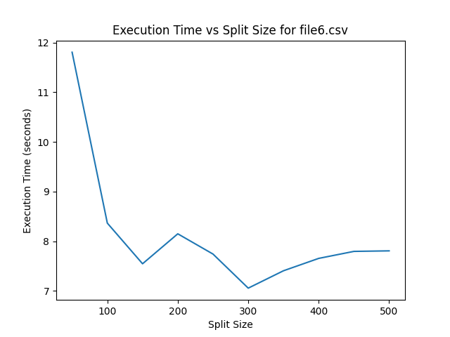

# ETL System with Parameter Sensitivity Analysis

This project contains an extract, transform, load (ETL) system implemented in Python. The system extracts data from CSV files, transforms it as required, and loads it into a database using multithreading pipeline with different number of splits.

The system has been designed to perform parameter sensitivity analysis. Specifically, it plots the execution time of different split sizes as a parameter sensitivity.

## Getting Started

To get started with this project, you'll need to clone the repository to your local machine.

```
git clone https://github.com/yourusername/etl-system.git
```

### Prerequisites

To run the ETL system, you'll need to have Python 3.x and the following libraries installed:

- pandas
- matplotlib

You can install these libraries using pip:

```
pip install pandas matplotlib
```

### Usage

To use the ETL system, you'll need to modify the `extract`, `transform`, and `load` functions in the `etl_system.py` file to match the data you're working with and the database you're loading the data into. You'll also need to modify the `files` list to include the names of the files you're working with.

Once you've made the necessary modifications, you can run the `etl_system.py` file:

```
python etl_system.py
```

This will execute the ETL system for each file in the `files` list and plot the results.

## Parameter Sensitivity

The split size with minimum execution time is the best size for splitting the sample into chunks.

## Results Table

| File      | Split Size | Execution Time      |
| --------- | ---------- | ------------------- |
| file1.csv | 50         | 0.20094585418701172 |
| file1.csv | 100        | 0.17827415466308594 |
| file1.csv | 150        | 0.17514681816101074 |
| file1.csv | 200        | 0.15340137481689453 |
| file1.csv | 250        | 0.14460349082946777 |
| file1.csv | 300        | 0.15040111541748047 |
| file1.csv | 350        | 0.20209717750549316 |
| file1.csv | 400        | 0.17236852645874023 |
| file1.csv | 450        | 0.16457366943359375 |
| file1.csv | 500        | 0.1421055793762207  |
| file2.csv | 50         | 2.307406187057495   |
| file2.csv | 100        | 1.7599732875823975  |
| file2.csv | 150        | 1.4923429489135742  |
| file2.csv | 200        | 1.5830867290496826  |
| file2.csv | 250        | 1.8552417755126953  |
| file2.csv | 300        | 1.5105571746826172  |
| file2.csv | 350        | 1.3557870388031006  |
| file2.csv | 400        | 1.3610191345214844  |
| file2.csv | 450        | 1.5442559719085693  |
| file2.csv | 500        | 1.4554626941680908  |
| file3.csv | 50         | 25.979108810424805  |
| file3.csv | 100        | 4.078745126724243   |
| file3.csv | 150        | 2.9466161727905273  |
| file3.csv | 200        | 2.94527268409729    |
| file3.csv | 250        | 2.74124813079834    |
| file3.csv | 300        | 2.905269145965576   |
| file3.csv | 350        | 2.7017886638641357  |
| file3.csv | 400        | 2.9900853633880615  |
| file3.csv | 450        | 2.593247175216675   |
| file3.csv | 500        | 3.298258066177368   |
| file4.csv | 50         | 6.847970962524414   |
| file4.csv | 100        | 5.013974666595459   |
| file4.csv | 150        | 4.832691192626953   |
| file4.csv | 200        | 4.212059020996094   |
| file4.csv | 250        | 4.449608564376831   |
| file4.csv | 300        | 4.556971788406372   |
| file4.csv | 350        | 4.168123006820679   |
| file4.csv | 400        | 3.955108404159546   |
| file4.csv | 450        | 4.06095290184021    |
| file4.csv | 500        | 4.1308183670043945  |
| file5.csv | 50         | 9.166467428207397   |
| file5.csv | 100        | 6.776137351989746   |
| file5.csv | 150        | 6.431054353713989   |
| file5.csv | 200        | 5.924649000167847   |
| file5.csv | 250        | 6.377595901489258   |
| file5.csv | 300        | 6.412623643875122   |
| file5.csv | 350        | 5.8309972286224365  |
| file5.csv | 400        | 6.2015626430511475  |
| file5.csv | 450        | 5.77849555015564    |
| file5.csv | 500        | 5.95037579536438    |
| file6.csv | 50         | 11.803784608840942  |
| file6.csv | 100        | 8.365172863006592   |
| file6.csv | 150        | 7.54716157913208    |
| file6.csv | 200        | 8.14978551864624    |
| file6.csv | 250        | 7.742202997207642   |
| file6.csv | 300        | 7.056695938110352   |
| file6.csv | 350        | 7.406182289123535   |
| file6.csv | 400        | 7.655244588851929   |
| file6.csv | 450        | 7.796271800994873   |
| file6.csv | 500        | 7.806875467300415   |

## Visual Plots

The plot of split size vs execution time for the different files are as shown.








## Acknowledgments

This project was inspired by the need to perform parameter sensitivity analysis on ETL systems. Special thanks to the Pandas and Matplotlib teams for providing the libraries we used to implement this system.
